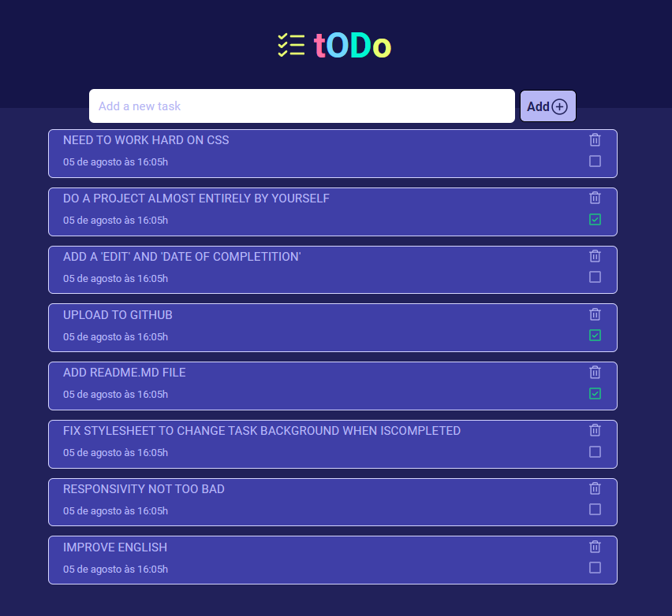

### new project at <a href="https://github.com/ricardroberg/rocketseat-projeto01-todo">LINK</a>

# MY FIRST TODO PROJECT

 

## Using React.js / Typescript / Vite / uuid / Phosporicons / etc

Its a simple two components site (Header and Todo), using .module.css to work with CSS and set some colors variables in global.css

Been a good exercise to learn how to type objects.

 
A lot of things to improve but I'm glad to finish it. I've been working on more complex projects in my company (as intern) but its the first time i do a project from beginning to end

 

### Hope to improve my README.md markdown skill too.
 

###### Thanks Rocketseat 🚀
